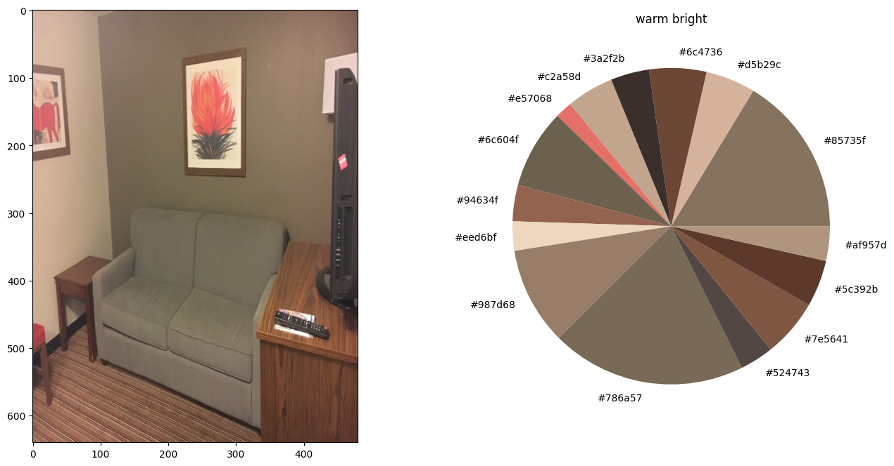

# 2023-cv-aliens
Отборочное задание на смену в Сириус 2023 по Computer Vision

Заранее прошу прощения за несколько jupyter-ноутбуков вместо одного. В них используются разные модели, постаралась подробно описать здесь их суть.

## Образ и предпочтение инопланетян ##
Спросим у StableDiffusion как выглядят инопланетяне
Выберем параметры, которые предположительно будут интересны инопланетянам.

1) Цвета
2) Геометрические формы
3) Освещение (холодное/теплое, яркое/темное)
~~4) Размеры (инопланетяне могут отличаться от людей)~~
5) Материалы (вдруг у них аллергия на металл)
6) Объекты на картинке - какая комната изображена и предметы мебели

Все вышеперечисленные параметры являются либо физическими, либо математическими. Это хорошо, так как предположительно инопланетяне имеют о них представление.
Оценить размеры на фотографии довольно сложно, очень влияет переспектива. Можно было бы оценить насколько комната просторная или наоборот узкая - но в решении я это не рассматривала.
Геометрические формы и материалы может определить нейросеть при ее описании. Но как оказалось позже, довольно сложно классифицировать по этим параметрам.

В своем решении я остановилась на цвете и свете. Это довольно важные параметры. Т.к. атмосфера на другой планете отличается, инопланетяне могут предпочитать или недолюбливать определенные цвета (даже если они не распознают изображения как мы, возможно они по-другому различают длины волн). Кроме того звезда в их родной системе (и свет от нее после преломления в атмосфере) могут отличаться от нашего привычного белого. Поэтому они могут предпочитать более холодное или теплое, а также более светлое или затемненное освещение.

## Изучение датасета фотографий ##
Для начала разберемся с темой и проблематикой задачи:

1) Задача относится к разделу Image Captioning и является image2text задачей. Т.е. приходящей на вход картинке необходимо сопоставить текст - её описание.

2) Над этим работают, потому что отображение: картинки -> текст применяется в реальной жизни . Например, эта технология может помочь людям с ограниченными возможностями узнавать что показано на изображении. Кроме того, это активно используется в онлайн-сервисах.

!!! 3) Задача заключается в том, чтобы разметить выборку из отелей по базовым словам-тэгам + составить описания для каждой информации. Для каждого отеля имеется набор его фотографий.

4) На изображениях представлены фотографии комнат внутри отеля. Это и спальни, и кухни, и ванные комнаты.

!!! 5) Датасет имеет структуру `images/train/chain_id/hotel_id/data_source/image_id.png` Сколько объектов в датасете? Сколько уникальных классов? Сбалансирован ли датасет?

6) Изначально изображения в формате jpg. При скачивании я переформатировала в png и изменила размер, чтобы максимальный (ширина или длина) был 640 пикселей. Некоторые изображения были в формате RGBA, а не RGB, 

## Обогащение датасета описаниями ##

1) Использованная предобработка: считывание файлов библиотекой PIL + применение метода convert(mode='RGB'). Две из трех примененных моделей (CLIP и BLIP) работают напрямую с PIL.Image типом данных в формате 'RGB', поэтому такой предобработки достаточно. Для третьей модели (KMeans) переводила в numpy.ndarrays c shape=(width*size, 3). Кроме того, при скачивании картинки были уменьшены в размере до 640 пикселей, чтобы ускорить время прдсказания и снизить кол-во используемой памяти GPU.

### Используемые методы добавления описания ###

** 1. BLIP ** 
Источник: `Salesforce/blip-image-captioning-large` HuggingFace

Модель выполняет задачу Image Captioning, т.е. генерирует текстовое описание к картинке. Полученные описания являются решением задачи, потому что заменяют картинки словами, которые мы умеем переводить для инопланетян. Но если посмотреть на итоговые описания - они несут мало информации, в основном описывают предметы мебели и по ним сложно выбрать конкретный отель.

** 2. CLIP **
Источник: `openai/clip-vit-base-patch32` Hugging Face
Эта модель может выбирать из предоставленных предложений наиболее подходящее к картинке. Используем ее, чтобы выделить особенности комнаты, важные для инопланетян (цвета, освещение, геометрические формы). Вместе с изображениями передается набор классов, предсказанием является вероятности для классов.

Примененные классы: 

`colors = ['red', 'green', 'blue', 'yellow', 'magenta', 'pink', 'purple', 'orange', 'cyan']
light1 = ['dark', 'bright']
light2 = ['warm', 'cool']
shapes = ['circle', 'rectangle', 'triangle', 'square', 'sphere', 'cube', 'pyramid']`

При проверке руками, оказалось, что получается довольно плохо. Геометрические формы из-за характерной формы мебели всегда определяются прямоугольником, поэтому для модели заметить другие очертания почти невозможно. Цвет и вид освещения тоже определяется некорретно для человеческого глаза (темные комнаты как светлые, коричневые как оранжевые).
Поэтому параметр 'геометрические формы' решено отбросить, а для оценки цвета/света придумана другая модель (следующая в списке).

Но модель CLIP использовалась для классификации вида комнаты из списка
`['living room', 'kitchen', 'bathroom', 'hallway', 'dining room', 'bedroom']`

** 3. Kmeans **
Источник: `sklearn.cluster.Kmeans` библиотеки scikit-learn

Идея заключается в том, чтобы определить алгоритмом кластеризации N самых часто встречаемых цветов по картинке. Далее по ним классифицировать освещение по теплоте и яркости. А также построить распределение этих цветов, которое будет передавать цветовую гамму. 

