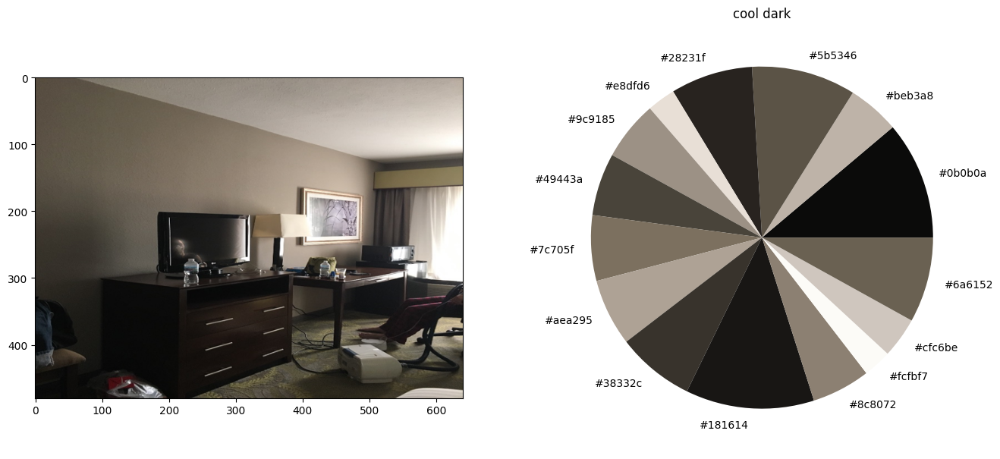

# 2023-cv-aliens
Отборочное задание на смену в Сириус 2023 по Computer Vision

Заранее прошу прощения за несколько jupyter-ноутбуков вместо одного. В них используются разные модели, постаралась подробно описать здесь их суть.

О структуре гитхаба: файл main содержит анализ датасета + сбор всех признаков, полученных тремя моделями (остальные ноутбуки). Из признаков формируется база данных - файл all_data.csv и написана функция получения информации по конкретной комнате.

## Образ и предпочтение инопланетян ##
Спросим у StableDiffusion как выглядят инопланетяне.
Выберем параметры, которые предположительно будут интересны инопланетянам.

1) Цвета
2) Геометрические формы
3) Освещение (холодное/теплое, яркое/темное)
4) Размеры (инопланетяне могут быть больше или меньше человека)
5) Материалы (вдруг у них аллергия на металл)
6) Объекты на картинке - какая комната изображена и предметы мебели

Все вышеперечисленные параметры являются либо физическими, либо математическими. Это хорошо, так как предположительно инопланетяне имеют о них представление.
Оценить размеры на фотографии довольно сложно, очень влияет переспектива. Можно было бы оценить насколько комната просторная или наоборот узкая - но в решении я этого не рассматривала.

В своем решении я остановилась на цвете и свете. Это довольно важные параметры. Т.к. атмосфера на другой планете отличается, инопланетяне могут предпочитать или недолюбливать определенные цвета (даже если они не распознают изображения как мы, возможно они по-другому различают длины волн). Кроме того звезда в их родной системе и свет от нее после преломления в атмосфере могут отличаться от нашего привычного белого. Поэтому они могут предпочитать более холодное или теплое, а также более светлое или темное освещение.

## Изучение датасета фотографий ##
Для начала разберемся с темой и проблематикой задачи:

1) Задача относится к разделу Image Captioning и является image2text задачей. Т.е. приходящей на вход картинке необходимо сопоставить текст - её описание.

2) Над этим работают, потому что отображение: картинки -> текст имеет множество применений. Например, эта технология помогает людям с ограниченными возможностями узнавать что показано на изображении. Кроме того, это активно используется в онлайн-сервисах, где огромная база данных изображений не позволяет размечать их вручную.

3) Вначале задания написано *вам надо разметить отели по этим базовым словам-тегам для удобного поиска*, но затем просят *обработайте каждую фотографию из выборки, добавьте к ней описание.* Мое пониманию задачи: составить текстовое описание к каждой фотографии + придумать слова-тэги, по которым инопланетянам будет удобно искать подходящий номер\отель и тоже разметить по ним номера\отели. В моем решении описания сделаны для комнат отдельно + выделены характерные особенности отеля, которые тоже добавляются к описанию комнаты. 

4) На изображениях представлены фотографии комнат внутри. Это и спальни, и кухни, и ванные комнаты.

5) Датасет имеет структуру `images/train/chain_id/hotel_id/data_source/image_id.png`. То есть есть можно разбить на классы по сетям отелей или по самим отелям. Размер датасета: 18781 (я использовала 13150 фотографий, т.к. остальные видимо повредились при загрузке. Размер выбранной выборки отличается в 1.5 раза, т.е. это не сильно критично - если посчиталось на них, то посчитается и на всем датасете).
   Количество отелей:  7337
   Количество сетей отелей:  89
Классы сильно несбалансированы (это показано на графиках в main). Вхождения в одни классы превышает в десятки-сотни раз вхождения в другие классы.

6) Изначально изображения в формате jpg. При скачивании я переформатировала в png и изменила размер, чтобы максимальный (ширина или длина) был 640 пикселей. Некоторые изображения были в формате RGBA, а не RGB, 

## Обогащение датасета описаниями ##

1) Использованная предобработка: считывание файлов библиотекой PIL + применение метода convert(mode='RGB'). Две из трех примененных моделей (CLIP и BLIP) работают напрямую с PIL.Image типом данных в формате 'RGB', поэтому такой предобработки достаточно. Для третьей модели (KMeans) переводила в numpy.ndarrays c shape=(width*size, 3). Кроме того, при скачивании картинки были уменьшены в размере до 640 пикселей, чтобы ускорить время предсказания и снизить кол-во используемой памяти GPU.

### Используемые методы добавления описания ###

**1. BLIP** 
Источник: `Salesforce/blip-image-captioning-large` HuggingFace

Модель выполняет задачу Image Captioning, т.е. генерирует текстовое описание к картинке. Полученные описания являются решением задачи, потому что заменяют картинки словами, которые мы умеем переводить для инопланетян. Но если посмотреть на итоговые описания - они несут мало информации, в основном описывают предметы мебели и по ним сложно выбрать конкретный отель.

Поэтому я применила tf-idf анализ для сгруппированных по отелям описаний, чтобы найти характерные для отеля слова. Также я пробовала группировать по сетям отелей, но получилось хуже и в итоговые параметры это не вошло. Слова получились неидеально (присутствуют общие слова hotel, is, and), но для отдельных случаев метод выявил необычные предметы мебели (fireplace, glass sliding door, television), а также цвета, материалы и прилагательные (small, wooden). Я думаю, с доработкой метод может сильно улучшить описание комнаты.

**2. CLIP**
Источник: `openai/clip-vit-base-patch32` Hugging Face
Эта модель может выбирать из предоставленных предложений наиболее подходящее к картинке. Используем ее, чтобы выделить особенности комнаты, важные для инопланетян (цвета, освещение, геометрические формы). Вместе с изображениями передается набор классов, предсказанием является вероятности для классов.

Примененные классы: 

`colors = ['red', 'green', 'blue', 'yellow', 'magenta', 'pink', 'purple', 'orange', 'cyan']
light1 = ['dark', 'bright']
light2 = ['warm', 'cool']
shapes = ['circle', 'rectangle', 'triangle', 'square', 'sphere', 'cube', 'pyramid']`

При проверке руками, оказалось, что получается довольно плохо. Геометрические формы из-за характерной формы мебели всегда определяются прямоугольником, поэтому для модели заметить другие очертания почти невозможно. Цвет и вид освещения тоже определяется некорретно для человеческого глаза (темные комнаты как светлые, коричневые как оранжевые).
Поэтому параметр 'геометрические формы' решила отбросить, а для оценки цвета/света придумана другая модель (следующая в списке).

Но модель CLIP использовалась для классификации вида комнаты из списка
`['living room', 'kitchen', 'bathroom', 'hallway', 'dining room', 'bedroom']`

**3. Kmeans**
Источник: `sklearn.cluster.Kmeans` библиотеки scikit-learn

Идея заключается в том, чтобы определить алгоритмом кластеризации N самых часто встречаемых цветов по картинке + частоту их встречания. Далее по ним классифицировать освещение по теплоте и яркости. А также построить распределение этих цветов, которое будет передавать цветовую гамму. 

Классификация освещения получаем следующим образом. Все N самых часто встречаемых цветов складываем с весами их частоты - получаем среднее (R, G, B) цветовой гаммы. Затем:
`if (R+G+B)/3 > 100 bright else dark`
`if R > (B+0.2G) warm else cool`
Параметры 0.2 и 100 подобраны эмпирически и руками

**Небольшой вывод**
Представление через цветовую гамму с оценкой яркости и теплоты освещения может помочь инопланетянам в выборе комнаты. То есть, передаем названия цветов с их весами, а инопланетяне воспроизводят 'картинку'. Думаю, сочетание цветов для них является параметром красоты. А тип комнаты (ванная, спальня...) + теги warm/cool dark/light помогут убрать нежелательные варианты и понять какие цвета в какой комнате (возможно это тоже играет роль).

### Изменение изображения при помощи диффузионной модели ###
